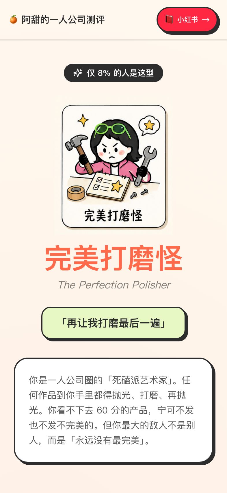

<div align="center">


# 🍊 一人公司型人格测评

### One Person Company Personality Test

#### 16 道扎心的题，看清你做一人公司的真实模样

[](https://nextjs.org)
[](https://react.dev)
[](https://www.typescriptlang.org)
[](https://tailwindcss.com)
[](LICENSE)

### 🚀 [打开测试 → opc.atian.vip](https://opc.atian.vip/)

</div>

> 这是 **@年轻朋友阿甜** 和豪哥一起做的开源小测评，
> 免费送给所有想做一人公司 / AI 超级个体 / 自由职业的朋友 🧡

---

## ✨ 它能做什么

3 分钟，16 道二选一的题，告诉你：

- 你是 **12 种「一人公司型人格」** 中的哪一种
- 你的「死循环」长什么样（为什么你总卡在某个地方）
- 你的「最佳搭子」是哪种型人格（找互补不找同款）

> 完美打磨怪？AI 工具狂？还是 All in 永动机？
> 你以为的你，和真实的你，往往差很远。

<div align="center">

| 首页 | 结果页 |
|:---:|:---:|
|  |  |

</div>

## 📑 目录

- [12 种型人格](#-12-种型人格)
- [谁适合用它](#-谁适合用它)
- [快速上手](#-快速上手)
- [技术栈](#️-技术栈)
- [关于我们](#-关于我们)
- [商务合作](#-商务合作)
- [致谢](#-致谢)
- [开源许可](#-开源许可)
- [免责声明](#️-免责声明)

## 🎭 12 种型人格

按 4 个维度（**O/M** 输出 vs 慢工 · **P/S** 计划 vs 直觉 · **X/Z** 执行 vs 拖延 · **F/M** 完美 vs 草稿）排列组合：

| | | | |
|---|---|---|---|
| 🔍 **完美打磨怪** (OPXF) | 📊 **KPI 自虐狂** (OPXM) | 💭 **明日复明日** (OPZF) | 💸 **变现幻想家** (OPZM) |
| 📉 **后台焦虑党** (OSXF) | 🔥 **All in 永动机** (OSXM) | 🧘 **佛系无为派** (OSZF) | 📋 **爆款复刻人** (OSZM) |
| 📚 **课程囤积癖** (MPXF) | 🔮 **玄学算法党** (MPZM) | 🔀 **赛道横跳侠** (MSXM) | 🤖 **AI 工具狂** (MSZM) |

每种型人格都有一张专属插画 + 死循环描述 + 互补型推荐 + 阿甜的私人建议。

## 🧡 谁适合用它

- 🚀 **想做一人公司 / 超级个体** 但还没想清楚自己适合哪条路的人
- 🤖 **AI 工具党** 想看看自己是单纯工具狂还是真有产出
- ✍️ **内容创作者** 想找到自己的死循环和搭子
- 💻 **开发者** 想看怎么用 Next.js 15 + Zustand 做个静态测评应用

## 🚀 快速上手

> 普通用户**不用看这段**，直接[打开 opc.atian.vip](https://opc.atian.vip/) 就能测。
> 这段是给想 fork 改造、本地跑、自己部署的开发者看的。

不会代码？复制下面这段，发给 ChatGPT / Claude / 豆包 / 通义千问 任何一个 AI：

```
我想在我的电脑上部署这个开源项目：
https://github.com/atian-create/opc-test

我的系统是 Mac（或 Windows，选一个）。

请一步一步教我，每一步具体要打什么命令、点什么按钮。
遇到错误我会截图发给你。
```

AI 会从装 Node.js 开始一路带你跑通。不懂的地方继续问它就行。

会代码的同学：

```bash
git clone https://github.com/atian-create/opc-test.git
cd opc-test
npm install
npm run dev
# → 打开 http://localhost:3000
```

> 💡 **零依赖外部 API** — 这个项目纯前端 + 静态导出，不需要任何 API key，clone 下来就能跑。

## 🛠️ 技术栈

| 层 | 技术 |
|---|---|
| 框架 | [Next.js 15](https://nextjs.org) (App Router · 静态导出) |
| UI | [React 19](https://react.dev) + [TypeScript](https://www.typescriptlang.org) |
| 状态 | [Zustand 5](https://zustand-demo.pmnd.rs/) (持久化答题进度) |
| 样式 | [Tailwind CSS 3](https://tailwindcss.com) |
| 图标 | [Lucide](https://lucide.dev) |
| 分享图 | [html2canvas](https://html2canvas.hertzen.com/) (中文基线 workaround) |

核心逻辑集中在几个文件：

- `lib/questions.ts` — 16 道题 + 4 维度计分映射
- `lib/personalities.ts` — 12 型人格数据（描述 / 死循环 / 互补型 / 建议）
- `lib/scoring.ts` — 4 维度计分 → 12 型人格匹配
- `lib/store.ts` — Zustand 答题状态持久化
- `app/result/page.tsx` — 结果页（雷达图 + 互补推荐 + 阿甜笔记 carousel）

## 👋 关于我们

**阿甜** · ENFP · 内容创作者 · AI 一人公司实践者 · 旅居曼谷中

[](https://www.xiaohongshu.com/user/profile/5e65e5720000000001004464)
[](https://space.bilibili.com/474328807)

> "越分享，越幸运"

**豪哥** · AI 玩家

> "AI 时代，一个人就是一支队伍"

我俩是夫妻档，一边做内容一边写代码。这个测评是我们一边研究一人公司、一边给自己也找答案的过程中长出来的。

## 💌 商务合作

品牌合作 / 商单 / 其他洽谈：

**小红书私信 → [@年轻朋友阿甜](https://www.xiaohongshu.com/user/profile/5e65e5720000000001004464)**

## 🙏 致谢

- **MBTI / 九型人格 / DISC** 等前辈框架 — 启发了我们用「型人格」这个语言
- **Zustand** — 让前端状态管理变得不痛苦
- **html2canvas** — 让分享图生成在浏览器里就能搞定
- **所有开源社区** — Next.js / React / Tailwind / Lucide 的维护者们
- **看到这里的你** — 谢谢你愿意点进来看一个小项目 🧡

## 📄 开源许可

[MIT License](LICENSE) — 代码随便拿去用、改、商用、学习，做什么都可以。

## ⚠️ 免责声明

- **测评结果仅供娱乐和自我观察**，不构成职业 / 创业 / 心理学诊断建议
- 12 种型人格是我们基于「一人公司」这个特定场景自创的分类，**不等同于 MBTI / 九型 / DISC** 等心理学量表
- 本软件按 MIT 协议开放使用，用户须自行承担使用过程中的所有后果

---

<div align="center">

**如果你测出了好玩的型人格，欢迎来小红书找阿甜聊聊 🧡**

Made with 🍊 by 阿甜 · 一人公司型人格测评 v1.0

</div>
